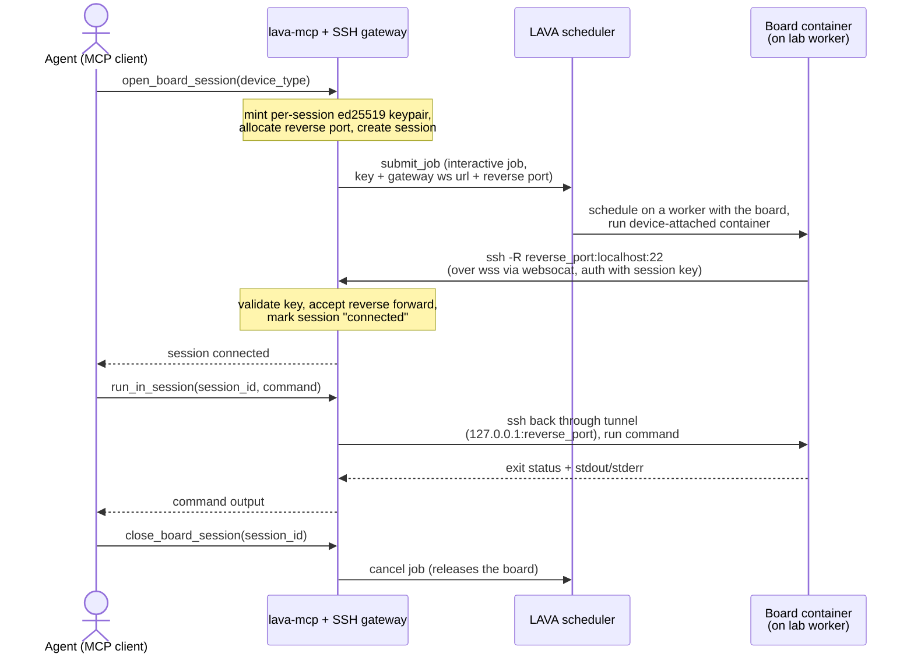
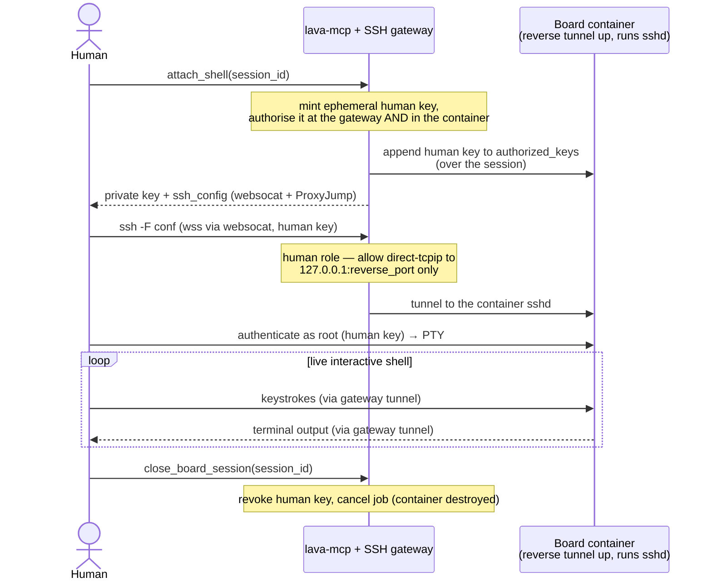

# Interactive board sessions (SSH gateway)

A board session is a shell in a container running *next to* the board (on the worker) —
**not** a shell on the board itself. Use it for host-side work against the device:
flashing, `fastboot`/`adb`, `qdl`, and bring-up. It needs the board's USB exposed to the
container.

This is the exception, not the default — prefer a normal
[deploy/boot/test job](lava-jobs.md) unless you specifically need live, manual control.
The sweet spot is an **iterative loop on one held board** (e.g. bisecting a regression)
where you repeatedly flash and/or boot changing artifacts and inspect the result,
without re-queuing a fresh job each round. For a single fixed run, prefer a normal job.

Requires hosted mode with `--gateway` (or `LAVA_MCP_GATEWAY_ENABLED=true`) and
`LAVA_MCP_GATEWAY_WS_URL` set — see [deployment.md](deployment.md).

## How it works

The server runs an in-process SSH rendezvous fronted by a WebSocket bridge.
`open_board_session` submits a LAVA job that runs a device-attached container; the
container dials **out** (`ssh -R`, tunnelled over `wss://.../mcp/gateway-ssh` via
`websocat`) to the gateway, so no inbound access to the worker is needed. The asyncssh
listener is loopback-only and reachable exclusively through the bridge; there is no
direct SSH port.



Tools:

- `open_board_session(device_type)` — reserves a board, submits the job, waits for the
  container to dial back. Returns the `session_id` and `connected: true`.
- `run_in_session(session_id, command)` — runs one command on the board's container
  (`qdl`, `fastboot`, `adb`, any shell); returns exit status, stdout and stderr.
- `attach_shell(session_id)` — a live interactive PTY (see below).
- `close_board_session(session_id)` — cancels the job and frees the board.
- `list_board_sessions()` — your open sessions.

The container image + test definition live in this repo under `interactive/` (published
to `ghcr.io/lava-mcp/lava-mcp/interactive` and fetched from this repo by the lab worker);
the parameter contract is in `lava_mcp/jobs.py`.

## Build tooling at runtime

The container is **Debian** (running as root), so a session can `apt-get` or build
whatever tooling it needs at runtime — you're not limited to what's pre-installed. For
example, fetch and build `qdl` from source and detect the attached board:

```sh
apt-get update && apt-get install -y git build-essential pkg-config \
    libusb-1.0-0-dev libxml2-dev
git clone https://github.com/linux-msm/qdl && make -C qdl
# With the board in EDL (Emergency Download) mode it enumerates as
# "vendor HS-USB QDLoader 9008" (05c6:9008) — confirm it's attached:
lsusb | grep -i '05c6:9008'
# the freshly built ./qdl/qdl can now flash it (prog + rawprogram/patch XMLs)
```

This is the point of the container-beside-the-board approach: you control *how* the
board is driven from the host — including trying a newer or custom flashing tool than
the one baked into the image.

## Power / recovery control

A board session runs in a container next to the board and has no direct power over it.
Instead it asks the dispatcher to run the device's LAVA command on the worker: call
`run_device_command(session_id, name)`, or inside a shell run `lava-device-command
<name>` (aliases: `lava-power-on`, `lava-power-off`, `lava-hard-reset`). Names:
`power_on`, `power_off`, `hard_reset`, `recovery_mode`, `recovery_exit`,
`pre_power_command`, `pre_os_command`, and any device `user_commands` (e.g. USB-port
toggles). This is how you power-cycle a board into EDL for flashing, or recover a wedged
one. It returns the command's exit status (0 = ran).

Two caveats: (a) a power cycle makes the DUT re-enumerate over USB, so wait for its
`lsusb` entry / device nodes to reappear before `adb`/`fastboot`/`qdl`; (b) it needs a
LAVA instance that supports the device-command relay — a non-zero/unavailable result
means the instance lacks it. A session can also record LAVA results with
`lava-signal 'TESTCASE TEST_CASE_ID=x RESULT=pass'`.

## Getting artifacts into the container

Pass token-guarded artifacts as `open_board_session(downloads=[{"url", "headers"}])`:
the server adds a LAVA download action so LAVA fetches them with your header/token and
mounts them at `/lava-downloads` in the container — the container itself cannot
substitute a token. See the [artifact store](artifact-store.md).

## Serial console alongside the shell

`open_board_session(console=true)` also gives you the board's serial console beside the
shell (via `attach_console`). The server adds and wires the ser2net-proxy Test Services
container automatically. See [serial-console.md](serial-console.md) for the console
model.

## Interactive SSH shell for humans (`attach_shell`)

For a live PTY in the board's **container** — not command-at-a-time — call
`attach_shell(session_id)`. This is a shell *next to* the board (not on it), for
controlling how the board is driven from the host — trying different flashing
software/versions, custom `fastboot`/`qdl`/`adb` sequences, or deeper USB debugging of a
board that won't boot. (For the board's own console, use `attach_console`.)

It mints a short-lived keypair, authorises it **both** at the gateway (for the tunnel)
and inside the board container (appended to its `authorized_keys` over the existing
session), and returns a private key plus a ready-to-use `ssh_config`. The config's jump
host tunnels to the gateway over `wss://.../mcp/gateway-ssh` (via `websocat`), then
`ProxyJump`s into the container's own sshd — the gateway forwards but offers no shell of
its own, and the container's key is never disclosed. Requires `websocat` on your PATH:

```sh
# save private_key to lava-shell-<id>.key (chmod 600) and ssh_config to
# lava-shell-<id>.conf, then:
ssh -F lava-shell-<id>.conf board-<id>
```



Human keys expire (`LAVA_MCP_GATEWAY_HUMAN_KEY_TTL`, default 1h) and are revoked on
`close_board_session`. Your source IP must be inside `LAVA_MCP_GATEWAY_ALLOW_IPS` if set.
The returned `private_key` must be saved with `chmod 600` — ssh refuses a looser key
file.

## Driving a session by hand (no agent)

The board-session tools are just MCP calls, so a person can drive the exact same
open → run → close flow by hand with any generic MCP client — no LLM involved. The
quickest is the [MCP Inspector](https://github.com/modelcontextprotocol/inspector):

```sh
npx @modelcontextprotocol/inspector
# In the UI: Transport = Streamable HTTP
#            URL       = https://<LAVA_MCP_DOMAIN>/mcp
#            Header    = X-Lava-Token: <your-api-token>
# (add X-Lava-Url too if the server is multi-tenant)
```

Then invoke `open_board_session` → `run_in_session` → `close_board_session` (or
`attach_shell` for a live PTY). This is command-at-a-time execution over the gateway,
not a live PTY unless you use `attach_shell`.

## Access control

Interactive features are gated (all default to open); the general LAVA-proxy tools are
never gated. Sessions are also gated **per device**: they only run on devices an admin
opted in by tagging with `allow-remote-access` (`LAVA_MCP_REMOTE_ACCESS_TAG`).
`open_board_session` checks up front that the device-type has at least one such device
and fails with an actionable message if not, and every interactive job is pinned to the
tag. See [configuration.md](configuration.md) for the allowlists and
[security.md](security.md) for the full trust model.
