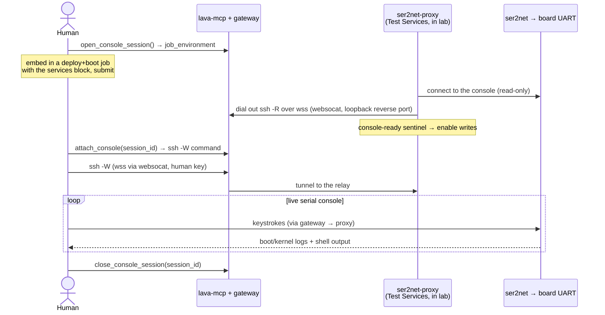

# Direct serial console via ser2net

Where [`attach_shell`](board-sessions.md) gives you the board's *userspace* (it needs a
booted, networked board), a **serial console** is the board's actual UART — boot/kernel/
panic logs, works with no DUT networking, and the login prompt itself. Reach for it to
interact with the booted board directly: drive tests and run commands live at the
console *without writing a LAVA test definition*, watch the boot, or work with the
bootloader/login prompt.

Many LAVA labs front the UART with [ser2net](https://github.com/cminyard/ser2net) (the
device dict's `connection_command` is `telnet <ser2net-host> <port>`), and LAVA drives
boot over that same console. Only ser2net (telnet) consoles can be proxied.

Requires hosted mode with the gateway enabled — see [deployment.md](deployment.md).

## Why a proxy is needed

The container LAVA runs your test/session in generally can't reach the lab's ser2net
endpoint, so a sibling **LAVA Test Services** container (`interactive/ser2net-proxy/`)
on the dispatcher network relays the UART out. This applies to **any** job that connects
to the serial console — not just interactive ones. Console access therefore needs a
device that allows Test Services (`allow_test_services: true` in the device dict — check
with `check_serial_console_support`).

## Two ways to reach the console

### Alongside a board session

`open_board_session(console=true)` adds and wires the proxy automatically; you just call
`attach_console(console_session_id)`. See [board-sessions.md](board-sessions.md).

### With your own deploy+boot job (Mode 2)

Used with a LAVA job that deploys and boots an image and runs its test *on the board*
(no device-attached container). Build the deploy+boot job exactly as in the
[standard workflow](lava-jobs.md) — adapt a `find_boot_template` match and **keep its
artifact auth** — then add the console proxy on top.

You don't need an example: `open_console_session` returns the exact `services` action,
the console-ready action, and the `environment:` values to add (in its `add_to_job`
field).

Flow:

1. `check_serial_console_support(device_type)` — confirm the device allows Test Services.
2. `open_console_session()` mints a session and returns a `job_environment` block. Add it
   to your deploy-and-boot job's top-level `environment:`, include the
   `interactive/ser2net-proxy` **services** block as the first action, and set the
   `SER2NET_*` vars for your lab. Submit the job.
3. The proxy starts at the beginning of the job, relays the console **read-only** while
   LAVA drives the boot, and dials **out** (`ssh -R`) to the gateway. When your
   console-ready test echoes the sentinel (`LAVA_MCP_CONSOLE_WRITABLE`), the proxy
   enables writes.
4. Poll `check_console_ready(job_id)` until `ready: true` (instead of reading logs), then
   call `attach_console(session_id)`. It returns an `ssh -W` command that tunnels to the
   gateway over `wss://.../mcp/gateway-ssh` (via `websocat`; wrap with `socat` for a raw
   PTY) — you get the live UART, bridged through the gateway on a loopback-only port.
5. `close_console_session(session_id)` revokes access; ending the job tears down the
   proxy.

## Console handoff wrinkle

ser2net must allow the proxy's concurrent connection. The console-ready action
`open_console_session` returns holds the job open with an interactive shell (LAVA
tolerates a silent console — a test-shell expect timeout just loops, so no keepalive is
needed); the user ends the session by exiting the shell.

## Getting artifacts to the board first

`open_console_session` accepts `downloads=[{"url", "headers"}]` too, so LAVA fetches
token-guarded artifacts (with your header/token) into the job before the console step.
See the [artifact store](artifact-store.md).

## Tools

`check_serial_console_support`, `open_console_session`, `check_console_ready`,
`attach_console`, `close_console_session`.
